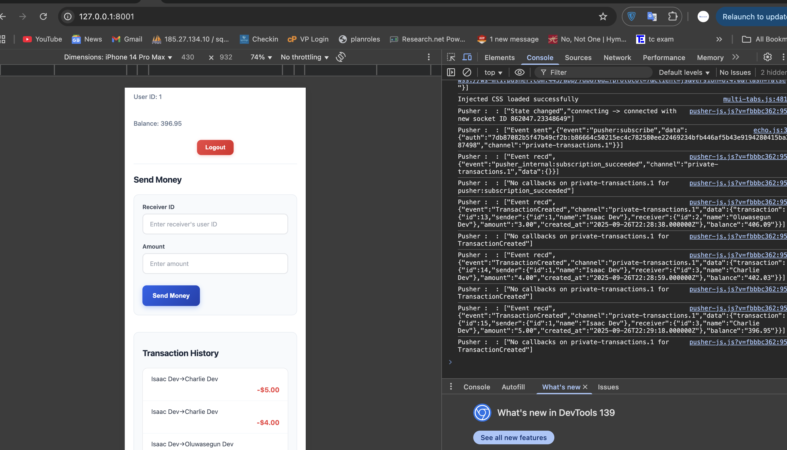

# Pimono Mini Wallet App

A simple wallet application built with **Laravel 10**, **Vue 3**, **Axios**, and **Pusher** for real-time transactions.

---

## Table of Contents

* [Requirements](#requirements)
* [Installation](#installation)
* [Environment Setup](#environment-setup)
* [Database Setup](#database-setup)
* [Running the Application](#running-the-application)
* [Pusher Real-Time Setup](#pusher-real-time-setup)
* [Notes](#notes)

---

## Requirements

* PHP >= 8.4.7
php --version
PHP 8.4.7 (cli) (built: May  6 2025 12:31:58) (NTS)
Copyright (c) The PHP Group
Built by Homebrew
Zend Engine v4.4.7, Copyright (c) Zend Technologies
    with Zend OPcache v8.4.7, Copyright (c), by Zend Technologies
isaacoyekunle@ISAACs-MacBook-Air pimono-mini-wallet % 

* Composer
* Node.js >= 18
* npm or yarn
* MySQL

---

## Installation

1. Clone the repository:

```bash
https://github.com/oyekunleisaac/pimono-technical-interview-isaacoyekunle.git
cd pimono-mini-wallet
```

2. Install backend dependencies:

```bash
composer install
```

3. Install frontend dependencies:

```bash
npm install
# or
yarn install
```

---

## Environment Setup

1. Copy `.env.example` to `.env`:

```bash
cp .env.example .env
```

2. Generate application key:

```bash
php artisan key:generate
```

3. Configure `.env`:

```env
APP_NAME="Pimono Mini Wallet"
APP_URL=http://localhost:8001

DB_CONNECTION=mysql
DB_HOST=127.0.0.1
DB_PORT=3306
DB_DATABASE=pimono_mini_walletDB
DB_USERNAME=root
DB_PASSWORD=

BROADCAST_DRIVER=pusher
PUSHER_APP_ID=your-pusher-app-id
PUSHER_APP_KEY=your-pusher-key
PUSHER_APP_SECRET=your-pusher-secret
PUSHER_APP_CLUSTER=mt1

SANCTUM_STATEFUL_DOMAINS=localhost:5173
SESSION_DOMAIN=127.0.0.1
```

> Adjust ports and database credentials as needed.

---

## Database Setup

1. Create the database (`pimono_mini_walletDB`) if it doesn’t exist.
2. Run migrations and seeders:

```bash
php artisan migrate --seed
```

This will create necessary tables and seed sample users & transactions.

---

## Running the Application

### Backend (Laravel)

```bash
php artisan serve
```

The Laravel app was run on `http://127.0.0.1:8001` if you are on a different route, update .env.


## Queue Worker (Required for Real-Time Broadcasting)

Laravel uses queues to process broadcasting events.  
**Kindly run the queue worker for real-time updates to work:**

```bash
php artisan queue:work
```

- In production, use a process manager like [Supervisor](https://laravel.com/docs/10.x/queues#supervisor-configuration) to keep the queue worker running.
- If the queue worker is not running, real-time events (Pusher) will not broadcast but the fallback polling can help in this case.

### Example: Pusher Dashboard (Real-Time Events)



### Frontend (Vite + Vue 3)

```bash
npm run dev
# or
yarn dev
```

By default, the frontend runs on `http://localhost:5173`.

---

## Pusher Real-Time Setup

1. Ensure your Pusher credentials are set in `.env`.
2. Laravel Echo is already configured in `resources/js/boot/echo.js`.
3. Real-time transactions use **private channels**: `transactions.{userId}`.
4. Make sure your front-end runs with `withCredentials: true` to allow authentication.

> **Tip:** If Pusher fails locally due to cookies, the app will silently fallback to polling every 10-15 seconds to ensure updates.

---

## Notes

* Default seeded user credentials:
* Users
Email: isaac@pimono.ai
Password: password

Email: oluwasegun@pimono.ai
Password: password

Email: charlie@pimono.ai
Password: password

* Logout clears local storage.
* Transactions are reflected in real-time via Pusher; polling fallback ensures consistency.
